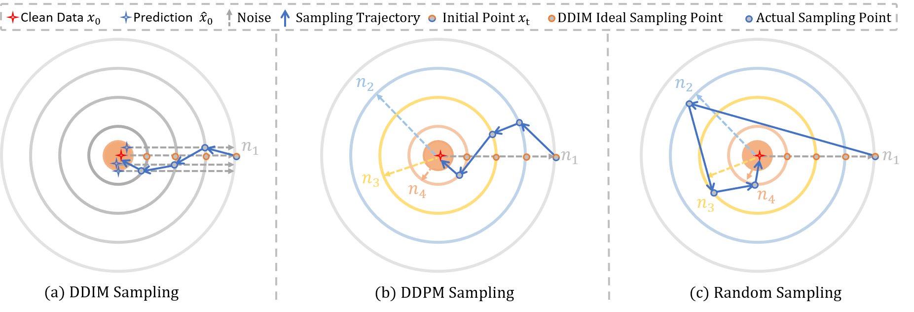

<div align="center">
  
# Random Sampling for Diffusion-based Adversarial Purification [](https://arxiv.org/abs/2411.18956)

Jiancheng Zhang, Peiran Dong, Yongyong Chen, Yin-Ping Zhao, Song Guo
</div>

### News

**2024.11.28 :** Our paper is available on [Arvix](https://arxiv.org/abs/2411.18956) and the code is released here.

## Abstract

Denoising Diffusion Probabilistic Models (DDPMs) have gained great attention in adversarial purification. Current diffusion-based works focus on designing effective condition-guided mechanisms while ignoring a fundamental problem, i.e., the original DDPM sampling is intended for stable generation, which may not be the optimal solution for adversarial purification. Inspired by the stability of the Denoising Diffusion Implicit Model (DDIM), we propose an opposite sampling scheme called random sampling. In brief, random sampling will sample from a random noisy space during each diffusion process, while DDPM and DDIM sampling will continuously sample from the adjacent or original noisy space. Thus, random sampling obtains more randomness and achieves stronger robustness against adversarial attacks.
Correspondingly, we also introduce a novel mediator conditional guidance to guarantee the consistency of the prediction under the purified image and clean image input. To expand awareness of guided diffusion purification, we conduct a detailed evaluation with different sampling methods and our random sampling achieves an impressive improvement in multiple settings. Leveraging mediator-guided random sampling, we also establish a baseline method named DiffAP, which significantly outperforms state-of-the-art (SOTA) approaches in performance and defensive stability. Remarkably, under strong attack, our DiffAP even achieves a more than 20% robustness advantage with $10\times$ sampling acceleration. 

## Differences in sampling trajectories

Conceptual illustration of the sampling trajectory of three different diffusion processes. The orange center area represents the distribution of clean samples, and the outer circle represents the sampling space after the noise disturbance. The noise intensity on the same circle is the same when the noise disturbance on the outer circle is greater.

## 1. Create Environment:

- Python 3 (Recommend to use [Anaconda](https://www.anaconda.com/download/#linux))

- [PyTorch >= 1.8](https://pytorch.org/)

- NVIDIA GPU + [CUDA](https://developer.nvidia.com/cuda-downloads)

- Python packages:

  ```shell
  pip install -r requirements.txt
  ```

## 2.Prepare Pretrained models and data
Before running our code, download the necessary pre-trained models and dataset. For CIFAR-10, we use the diffusion model identical to those in [DiffPure](https://github.com/NVlabs/DiffPure#requirements), which is available in [ScoreSDE](https://github.com/yang-song/score_sde_pytorch). We also use pre-trained classifiers, and for CIFAR-10, you don't need to download the models. After downloading the models and dataset, you must update their path in 'path.py'.

## 3.Test
There are several arguments to configure both attacks and defenses. `attack_method` specifies the chosen attack. `n_iter` and `eot` determine the number of update iterations and EOT (Expectation Over Transformation) samples, respectively. In our experiments, since the surrogate process in an attack might require different purification settings, separate arguments are used for specifying these details. For defense, `def_max_timesteps`, `def_num_denoising_steps`, `def_sampling_method`, and `def_guidance` determine the number of forward steps, the number of denoising steps, the sampling method, and the condition guidance, respectively. For attack, `att_max_timesteps`, `att_num_denoising_steps`, `att_sampling_method`, and `att_guidance` are used.

After setting the arguments, run the following commands:
```shell
cd RandomSampling 
python test.py
```

## Cite
If this repo helps you, please consider citing our work:
```
@misc{zhang2024randomsamplingdiffusionbasedadversarial,
      title={Random Sampling for Diffusion-based Adversarial Purification}, 
      author={Jiancheng Zhang and Peiran Dong and Yongyong Chen and Yin-Ping Zhao and Song Guo},
      year={2024},
      eprint={2411.18956},
      archivePrefix={arXiv},
      primaryClass={cs.CV},
      url={https://arxiv.org/abs/2411.18956}, 
}
```
